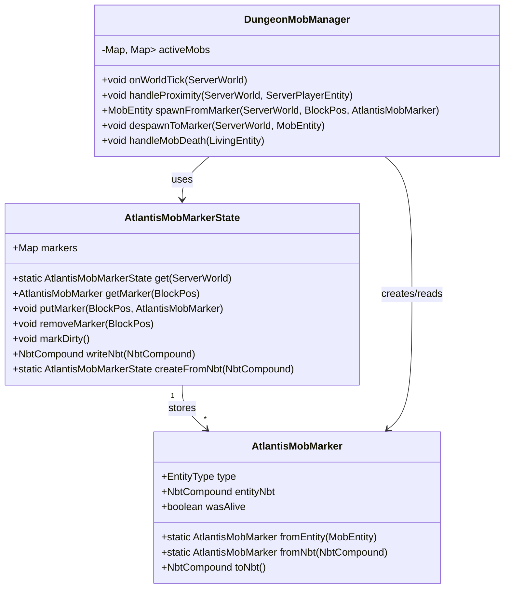

# Atlantis Dungeon Mob Marker System – Instructions for Copilot

> **Goal for Copilot:**
> Implement a **marker-based mob system** for an “Atlantis” dungeon that **despawns mobs to NBT** when far from players and **respawns them from markers** when players come near again (Option B: despawn + respawn on proximity).
>
> This system must:
>
> * Use a `PersistentState` to store mob markers.
> * Preserve entity NBT (HP, equipment, custom data, etc.).
> * Despawn mobs cleanly with no loot/xp when distance-based.
> * Respawn mobs from markers when players enter proximity.
> * Avoid double-spawning and keep performance reasonable.

---

## 1. UML Diagram (High-Level Design)



---

## 2. Folder / File Structure

> **Copilot:** Please assume a typical Fabric-style project layout and integrate the following files (or merge into existing ones where appropriate):

```text
src/main/java/com/example/atlantis/
    AtlantisMod.java                      # main entrypoint (existing or new)
    dungeon/
        DungeonMobManager.java            # runtime logic (proximity + spawn/respawn)
        AtlantisMobMarkerState.java       # PersistentState for mob markers
        AtlantisMobMarker.java            # simple record/POJO with NBT helpers
    mixin/
        ServerWorldMixin_AtlantisMarkers.java   # optional: hook world tick to DungeonMobManager
```

If the project already has different base packages, reuse them and only add the new classes where it fits best.

---

## 3. Step-by-Step Tasks for Copilot

> **Copilot:** Follow these tasks in order. Each task builds on previous ones.

---

### Task 1 – Create `AtlantisMobMarker` record/class

> Create a record-like class `AtlantisMobMarker` with these fields:
>
> * `EntityType<?> type`
> * `NbtCompound entityNbt`
> * `boolean wasAlive`
>
> Add helpers:
>
> * `static AtlantisMobMarker fromEntity(MobEntity entity)` – creates a marker from a live mob (uses `entity.getType()` and `entity.writeNbt`).
> * `static AtlantisMobMarker fromNbt(NbtCompound nbt, Registry<EntityType<?>> registry)` – loads type and entity NBT from a compound.
> * `NbtCompound toNbt(Registry<EntityType<?>> registry)` – writes type ID and entity data back into NBT.
>
> Use the registry to convert `EntityType` to/from its identifier, e.g. `"minecraft:zombie"`.

---

### Task 2 – Create `AtlantisMobMarkerState` (PersistentState)

> Create a class `AtlantisMobMarkerState` that extends `PersistentState`.
>
> It should:
>
> * Maintain `private final Map<BlockPos, AtlantisMobMarker> markers = new HashMap<>();`
> * Provide:
>
>   * `public AtlantisMobMarker getMarker(BlockPos pos)`
>   * `public void putMarker(BlockPos pos, AtlantisMobMarker marker)`
>   * `public void removeMarker(BlockPos pos)`
>   * `public Map<BlockPos, AtlantisMobMarker> getMarkers()` (unmodifiable or direct map if needed)
> * Implement persistence:
>
>   * `public static AtlantisMobMarkerState get(ServerWorld world)` using `world.getPersistentStateManager().getOrCreate(...)`
>   * Override `writeNbt(NbtCompound nbt)` to serialize all markers.
>   * Provide a static `createFromNbt(NbtCompound nbt, Registry<EntityType<?>> registry)` to deserialize.
>
> For storing positions:
>
> * Either store `BlockPos` as three ints (`x`, `y`, `z`) in a `List<NbtCompound>`.
> * Or if you prefer a map, store string keys like `"x,y,z"`.

---

### Task 3 – Integrate marker creation into existing dungeon spawn logic

> Find the current place where the Atlantis dungeon mobs are spawned (likely in something like a spawn manager or structure generation hook).
>
> Modify that code so that:
>
> 1. It creates the mob entity (in memory).
> 2. Wraps it into an `AtlantisMobMarker` using `AtlantisMobMarker.fromEntity(...)`.
> 3. Stores the marker into `AtlantisMobMarkerState` at the desired `BlockPos`.
> 4. **Does NOT spawn** the mob in the world at that time (skip `world.spawnEntity(entity)` for these dungeon mobs).
>
> These mobs should be identifiable via either:
>
> * A special tag (e.g. `"atlantis_spawned_mob"`), or
> * The fact that their positions appear in `AtlantisMobMarkerState`.

---

### Task 4 – Create `DungeonMobManager` class and tick entrypoint

> Create a class `DungeonMobManager` with:
>
> Fields:
>
> * `private static final int SPAWN_RADIUS_SQ = 48 * 48;`  // distance squared to spawn
> * `private static final int DESPAWN_RADIUS_SQ = 64 * 64;` // distance squared to despawn
> * `private final Map<RegistryKey<World>, Map<BlockPos, UUID>> activeMobs = new HashMap<>();`
>
> Methods:
>
> * `public void onWorldTick(ServerWorld world)`:
>
>   * For each non-spectator `ServerPlayerEntity` in that world, call `handleProximity(world, player)`.
> * `private void handleProximity(ServerWorld world, ServerPlayerEntity player)`:
>
>   * Load `AtlantisMobMarkerState` for the world.
>   * For markers in chunks near the player, decide whether to spawn or despawn.
>
> Provide static singleton-like access (e.g. `DungeonMobManager.getInstance()`).

---

### Task 5 – Implement `spawnFromMarker`

> In `DungeonMobManager`, implement:
>
> ```java
> public MobEntity spawnFromMarker(ServerWorld world, BlockPos pos, AtlantisMobMarker marker)
> ```
>
> Behavior:
>
> 1. Use `marker.type().create(world)` to create the entity.
> 2. If it's not a `MobEntity`, abort.
> 3. Load NBT into the entity using `entity.readNbt(marker.entityNbt())`.
> 4. Set position from the `BlockPos`.
> 5. Apply any required tags, e.g. `"atlantis_spawned_mob"`.
> 6. Call `world.spawnEntity(mob)`.
> 7. Update `activeMobs` for this world: `activeMobs.get(worldKey).put(pos, mob.getUuid())`.
> 8. Return the spawned mob.

---

### Task 6 – Implement `despawnToMarker`

> In `DungeonMobManager`, implement:
>
> ```java
> public void despawnToMarker(ServerWorld world, BlockPos pos, MobEntity mob)
> ```
>
> Behavior:
>
> 1. Get `AtlantisMobMarkerState` for the world.
> 2. Write entity NBT with `mob.writeNbt(new NbtCompound())`.
> 3. Create a new `AtlantisMobMarker` with the mob type and NBT, `wasAlive = true`.
> 4. Store/overwrite that marker in the state at `pos`.
> 5. Remove the mob from `activeMobs` map.
> 6. Call `mob.discard()` (not kill; no drops or XP).
> 7. Call `state.markDirty()`.

---

### Task 7 – Proximity-based spawn & despawn logic in `handleProximity`

> In `handleProximity`:
>
> 1. Compute squared distance between `player.getBlockPos()` and each marker’s `BlockPos`.
> 2. If distance² ≤ `SPAWN_RADIUS_SQ`:
>
>    * Check if this marker already has an active mob in `activeMobs`.
>    * If not, call `spawnFromMarker(...)`.
> 3. If distance² ≥ `DESPAWN_RADIUS_SQ` for an active mob:
>
>    * Look up the mob’s UUID in the world; if found and still alive, call `despawnToMarker(...)`.
>
> Use a simple hysteresis by keeping `SPAWN_RADIUS` < `DESPAWN_RADIUS` to avoid constant flickering.

To keep performance reasonable:

* Limit markers to scan by chunks near the player, not all markers.
* You can group markers in `AtlantisMobMarkerState` by chunk (e.g. `Map<Long, Map<BlockPos, AtlantisMobMarker>>` keyed by `ChunkPos.toLong()`).

---

### Task 8 – Hook `DungeonMobManager.onWorldTick` into the server tick

> Add a hook so that `DungeonMobManager.onWorldTick(world)` is called each tick (or every N ticks).
>
> For Fabric:
>
> * Use `ServerTickEvents.END_WORLD.register(world -> DungeonMobManager.getInstance().onWorldTick(world));`
>
> For Forge/NeoForge:
>
> * Use the appropriate world tick event (e.g. `WorldTickEvent`) and call `onWorldTick` inside it.
>
> Ensure this only runs on the **server side**.

---

### Task 9 – Handle mob death to remove markers

> Ensure that when an `"atlantis_spawned_mob"` dies **by taking damage**, its marker is removed permanently (no respawn).
>
> Implementation:
>
> * Subscribe to a living-entity-death event (Fabric/Forge equivalent).
> * If `entity instanceof MobEntity` and has the Atlantis tag:
>
>   * Determine its `BlockPos` (rounded to block grid).
>   * Load `AtlantisMobMarkerState` and remove the marker at that position.
>   * Remove from `activeMobs` as well.
>
> This guarantees that killed mobs stay dead and do not respawn.

---

### Task 10 – Prevent loot/XP on distance-based despawn

> When despawning due to distance in `despawnToMarker`, make sure the mob:
>
> * Does **not** drop items.
> * Does **not** drop XP.
>
> Because we’re using `mob.discard()`, it should already avoid drops.
> If there is any custom logic that triggers drops, introduce a custom flag or tag so those paths are skipped for Atlantis despawns.

---

### Task 11 – Ensure `AtlantisMobMarkerState` is properly saved

> Make sure:
>
> * `AtlantisMobMarkerState` calls `markDirty()` whenever markers are added/removed/updated.
> * `get(ServerWorld)` uses a static name like `"atlantis_mob_markers"` for the save key.
> * The `PersistentStateManager` registration is correct and world-specific.

---

### Task 12 – Optional: Chunk-based marker storage

> Optionally, optimize by grouping markers by chunk:
>
> * Change `AtlantisMobMarkerState` to:
>
>   * `Map<Long, Map<BlockPos, AtlantisMobMarker>> markersByChunk`
>   * Where the key is `ChunkPos.toLong(chunkX, chunkZ)`.
> * Provide helper methods:
>
>   * `getMarkersForChunk(ChunkPos chunkPos)`
>   * `getMarkersNear(BlockPos center, int chunkRadius)`
> * In `handleProximity`, only iterate over markers in the chunks within `chunkRadius` of the player’s chunk.
>
> This avoids scanning markers across the whole world.

---

### Task 13 – Optional: Debug commands

> Implement a debug command, e.g. `/atlantis markers`, that prints:
>
> * Total number of markers in the current world.
> * Total active mobs tracked in `DungeonMobManager`.
> * Optional: a short list of nearest markers to the player and their distances.
>
> This will help verify that despawn/respawn is working as expected.

---

## 4. Starter Code Snippets (Fabric-Oriented Examples)

> **Copilot:** Use these as starting points. Fill in TODOs and adjust imports/package names to match the existing project.

### 4.1 `AtlantisMobMarker` basic structure

```java
// package com.example.atlantis.dungeon;

public record AtlantisMobMarker(EntityType<?> type, NbtCompound entityNbt, boolean wasAlive) {

    public static AtlantisMobMarker fromEntity(MobEntity entity) {
        NbtCompound nbt = new NbtCompound();
        entity.writeNbt(nbt);
        return new AtlantisMobMarker(entity.getType(), nbt, true);
    }

    public static AtlantisMobMarker fromNbt(NbtCompound nbt, Registry<EntityType<?>> registry) {
        String typeId = nbt.getString("Type");
        Identifier id = new Identifier(typeId);
        EntityType<?> type = registry.get(id);

        NbtCompound entityNbt = nbt.getCompound("Entity");
        boolean wasAlive = nbt.getBoolean("WasAlive");
        return new AtlantisMobMarker(type, entityNbt, wasAlive);
    }

    public NbtCompound toNbt(Registry<EntityType<?>> registry) {
        NbtCompound nbt = new NbtCompound();
        Identifier id = registry.getId(type);
        if (id != null) {
            nbt.putString("Type", id.toString());
        }
        nbt.put("Entity", entityNbt);
        nbt.putBoolean("WasAlive", wasAlive);
        return nbt;
    }
}
```

---

### 4.2 `AtlantisMobMarkerState` skeleton

```java
// package com.example.atlantis.dungeon;

public class AtlantisMobMarkerState extends PersistentState {

    private final Map<BlockPos, AtlantisMobMarker> markers = new HashMap<>();

    public static AtlantisMobMarkerState get(ServerWorld world) {
        PersistentStateManager manager = world.getPersistentStateManager();
        Registry<EntityType<?>> registry = world.getRegistryManager().get(RegistryKeys.ENTITY_TYPE);

        return manager.getOrCreate(
                nbt -> AtlantisMobMarkerState.createFromNbt(nbt, registry),
                AtlantisMobMarkerState::new,
                "atlantis_mob_markers"
        );
    }

    public AtlantisMobMarkerState() {
    }

    public static AtlantisMobMarkerState createFromNbt(NbtCompound nbt, Registry<EntityType<?>> registry) {
        AtlantisMobMarkerState state = new AtlantisMobMarkerState();
        NbtList list = nbt.getList("Markers", NbtElement.COMPOUND_TYPE);
        for (int i = 0; i < list.size(); i++) {
            NbtCompound entry = list.getCompound(i);
            int x = entry.getInt("X");
            int y = entry.getInt("Y");
            int z = entry.getInt("Z");
            BlockPos pos = new BlockPos(x, y, z);

            AtlantisMobMarker marker = AtlantisMobMarker.fromNbt(entry.getCompound("Data"), registry);
            state.markers.put(pos, marker);
        }
        return state;
    }

    @Override
    public NbtCompound writeNbt(NbtCompound nbt) {
        Registry<EntityType<?>> registry = ... // TODO: obtain registry or pass in somehow
        NbtList list = new NbtList();

        for (Map.Entry<BlockPos, AtlantisMobMarker> entry : markers.entrySet()) {
            BlockPos pos = entry.getKey();
            AtlantisMobMarker marker = entry.getValue();

            NbtCompound e = new NbtCompound();
            e.putInt("X", pos.getX());
            e.putInt("Y", pos.getY());
            e.putInt("Z", pos.getZ());
            e.put("Data", marker.toNbt(registry));

            list.add(e);
        }

        nbt.put("Markers", list);
        return nbt;
    }

    public AtlantisMobMarker getMarker(BlockPos pos) {
        return markers.get(pos);
    }

    public void putMarker(BlockPos pos, AtlantisMobMarker marker) {
        markers.put(pos, marker);
        markDirty();
    }

    public void removeMarker(BlockPos pos) {
        if (markers.remove(pos) != null) {
            markDirty();
        }
    }

    public Map<BlockPos, AtlantisMobMarker> getMarkers() {
        return markers;
    }
}
```

*(Copilot: wire the registry access correctly – for example, keep a static reference to the registry in the mod entrypoint or pass it via constructor.)*

---

### 4.3 `DungeonMobManager` skeleton with tick handler

```java
// package com.example.atlantis.dungeon;

public class DungeonMobManager {

    private static final DungeonMobManager INSTANCE = new DungeonMobManager();

    private static final int SPAWN_RADIUS = 48;
    private static final int DESPAWN_RADIUS = 64;
    private static final int SPAWN_RADIUS_SQ = SPAWN_RADIUS * SPAWN_RADIUS;
    private static final int DESPAWN_RADIUS_SQ = DESPAWN_RADIUS * DESPAWN_RADIUS;

    private final Map<RegistryKey<World>, Map<BlockPos, UUID>> activeMobs = new HashMap<>();

    public static DungeonMobManager getInstance() {
        return INSTANCE;
    }

    public void onWorldTick(ServerWorld world) {
        List<ServerPlayerEntity> players = world.getPlayers();
        if (players.isEmpty()) return;

        for (ServerPlayerEntity player : players) {
            if (player.isSpectator()) continue;
            handleProximity(world, player);
        }
    }

    private Map<BlockPos, UUID> getActiveMap(ServerWorld world) {
        return activeMobs.computeIfAbsent(world.getRegistryKey(), k -> new HashMap<>());
    }

    private void handleProximity(ServerWorld world, ServerPlayerEntity player) {
        BlockPos playerPos = player.getBlockPos();
        AtlantisMobMarkerState state = AtlantisMobMarkerState.get(world);
        Map<BlockPos, AtlantisMobMarker> markers = state.getMarkers();
        Map<BlockPos, UUID> active = getActiveMap(world);

        // Simple implementation: iterate all markers, optimize later with chunk-based grouping
        for (Map.Entry<BlockPos, AtlantisMobMarker> entry : markers.entrySet()) {
            BlockPos pos = entry.getKey();
            AtlantisMobMarker marker = entry.getValue();

            double distSq = pos.getSquaredDistance(playerPos);
            boolean isActive = active.containsKey(pos);

            if (distSq <= SPAWN_RADIUS_SQ && !isActive) {
                // Need to spawn
                MobEntity mob = spawnFromMarker(world, pos, marker);
                if (mob != null) {
                    active.put(pos, mob.getUuid());
                }
            } else if (distSq >= DESPAWN_RADIUS_SQ && isActive) {
                // Need to despawn
                UUID id = active.get(pos);
                Entity e = world.getEntity(id);
                if (e instanceof MobEntity mob) {
                    despawnToMarker(world, pos, mob);
                } else {
                    active.remove(pos);
                }
            }
        }
    }

    public MobEntity spawnFromMarker(ServerWorld world, BlockPos pos, AtlantisMobMarker marker) {
        Entity entity = marker.type().create(world);
        if (!(entity instanceof MobEntity mob)) {
            return null;
        }

        // Load NBT
        mob.readNbt(marker.entityNbt());
        mob.refreshPositionAndAngles(pos.getX() + 0.5, pos.getY(), pos.getZ() + 0.5, mob.getYaw(), mob.getPitch());

        // Tag as Atlantis mob if needed
        mob.addCommandTag("atlantis_spawned_mob");

        if (world.spawnEntity(mob)) {
            return mob;
        }
        return null;
    }

    public void despawnToMarker(ServerWorld world, BlockPos pos, MobEntity mob) {
        AtlantisMobMarkerState state = AtlantisMobMarkerState.get(world);

        NbtCompound nbt = new NbtCompound();
        mob.writeNbt(nbt);

        AtlantisMobMarker marker = new AtlantisMobMarker(mob.getType(), nbt, true);
        state.putMarker(pos, marker);

        Map<BlockPos, UUID> active = getActiveMap(world);
        active.remove(pos);

        mob.discard();
    }

    public void handleMobDeath(ServerWorld world, MobEntity mob) {
        // Called from a global death listener
        if (!mob.getCommandTags().contains("atlantis_spawned_mob")) return;

        BlockPos pos = mob.getBlockPos();
        AtlantisMobMarkerState state = AtlantisMobMarkerState.get(world);
        state.removeMarker(pos);

        Map<BlockPos, UUID> active = getActiveMap(world);
        active.remove(pos);
    }
}
```

---

## 5. Mixin Example (Hooking World Tick to Manager)

> **Note:** This mixin is for **calling `DungeonMobManager.onWorldTick`**; it does **NOT** skip entity ticks. It’s purely to hook into world ticking for the despawn/respawn system.

```java
// package com.example.atlantis.mixin;

@Mixin(ServerWorld.class)
public abstract class ServerWorldMixin_AtlantisMarkers {

    @Inject(method = "tick", at = @At("TAIL"))
    private void atlantis$onTick(BooleanSupplier shouldKeepTicking, CallbackInfo ci) {
        ServerWorld world = (ServerWorld) (Object) this;
        DungeonMobManager.getInstance().onWorldTick(world);
    }
}
```
